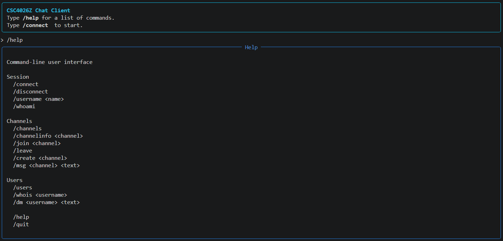

# WireGuard Chat Client

A terminal chat client that speaks a MessagePack-over-UDP protocol, optionally tunnelled
through a WireGuard handshake implemented from scratch — no `wg` binary, no tunnel library,
just the Noise primitives.



## What this demonstrates

The interesting part is `chat_client/crypto.py` and `chat_client/wireguard.py`: a working
implementation of the `Noise_IKpsk2_25519_ChaChaPoly_BLAKE2s` handshake, built up from the
primitives rather than from a protocol library.

- **Curve25519 ECDH** for the static and ephemeral key exchanges
- **BLAKE2s** as hash, keyed MAC (`mac1`), and HMAC — plus the `Kdf1/Kdf2/Kdf3` chaining
  construction that derives every key in the handshake
- **ChaCha20-Poly1305 AEAD** for the encrypted handshake payloads and transport messages,
  with a 64-bit little-endian counter nonce
- **TAI64N timestamps** for replay protection on the initiation message
- **Async UDP client** that multiplexes concurrent requests over one socket, correlating
  replies to callers by request handle via `asyncio.Future`

## Architecture

The layering is deliberate: the tunnel knows nothing about chat, and the chat protocol
knows nothing about encryption.

| Module | Responsibility |
|---|---|
| `chat_client/crypto.py` | Noise primitives — DH, hash, MAC, HMAC, KDF chains, AEAD, TAI64N |
| `chat_client/wireguard.py` | Handshake initiation/response, key derivation, transport framing |
| `chat_client/client.py` | Async UDP socket, session lifecycle, request/response correlation |
| `chat_client/protocol.py` | MessagePack request encoding for the chat protocol |
| `chat_client/ui.py` | Rich-based terminal UI and slash commands |

A message sent in encrypted mode travels
`ui.py` → `protocol.py` (MessagePack) → `client.py` → `wireguard.py` (AEAD + framing) → UDP.

## Setup

```bash
pip install -r requirements.txt
```

## Running the client

### Plaintext (port 51825)

```bash
python3 main.py --username <name>
```

### Encrypted via WireGuard (port 51820)

Retrieve your personal keypair from `https://csc4026z.link/keys`, then pass your
Base64-encoded private key:

```bash
python3 main.py --encrypted --username <name> --private-key-b64 <base64_private_key>
```

The public key is derived automatically from the private key.

#### Legacy hex format

```bash
python3 main.py --encrypted --username <name> \
    --private-key-hex <64-char-hex> \
    --public-key-hex <64-char-hex>
```

Or use environment variables instead of flags:

```bash
export CHAT_PRIVATE_KEY_HEX=<64-char-hex>
export CHAT_PUBLIC_KEY_HEX=<64-char-hex>
python3 main.py --encrypted --username <name>
```

### All flags

| Flag | Short | Description |
|------|-------|-------------|
| `--username` | `-u` | Set your username on connect |
| `--encrypted` | `-e` | Use the encrypted WireGuard endpoint |
| `--private-key-b64` | | Base64-encoded 32-byte private key |
| `--private-key-hex` | | Hex-encoded private key (legacy, requires `--public-key-hex`) |
| `--public-key-hex` | | Hex-encoded public key (used with `--private-key-hex`) |
| `--debug` | `-d` | Enable debug logging |

If `--username` is omitted, you can connect manually from within the UI using `/connect`.
`/help` lists the available commands.

## Tests

```bash
python -m pytest tests/ -v
```

The tests check the crypto primitives and the intermediate handshake values against the
worked example in the course specification — every hash, chaining key, and AEAD output is
pinned to a known-good byte string. They need no network, so they run anywhere.

## Limitations

Scoped to what the assignment specified; worth stating plainly:

- **`mac2` / cookie replies are not implemented.** `mac1` is computed correctly;
  `mac2` is sent as zeros.
- **The pre-shared key is all zeros**, as the specification dictates. The `psk2` position
  in the Noise pattern is therefore not contributing entropy.
- **No replay window on receive.** Incoming transport counters are used as the AEAD nonce
  but not validated against a sliding window, so a replayed packet would be accepted.
- **No rekeying or handshake expiry.** A session uses its initial transport keys for its
  whole lifetime.
- **The TAI64N nanosecond field carries microseconds**, matching the worked example in the
  specification that the server validates against.

The server, `csc4026z.link`, is course infrastructure and may not be reachable — the test
suite is the way to see the handshake working.

## Credits

Written by [Brage Sømoen](https://github.com/bragesom) and Magnus Engstrøm for CSC4026Z
(Network Security, University of Cape Town).

Licensed under the [MIT License](LICENSE).
